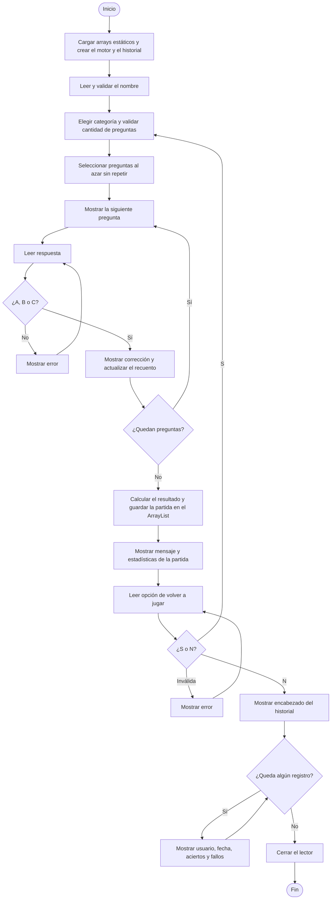

# Ciclo principal del quiz

```mermaid
flowchart TD
    A([Inicio]) --> B[Cargar arrays estáticos y crear el motor y el historial]
    B --> C[Leer y validar el nombre]
    C --> D[Elegir categoría y validar cantidad de preguntas]
    D --> E[Seleccionar preguntas al azar sin repetir]
    E --> F[Mostrar la siguiente pregunta]
    F --> G[Leer respuesta]
    G --> H{"¿A, B o C?"}
    H -- No --> I[Mostrar error]
    I --> G
    H -- Sí --> J[Mostrar corrección y actualizar el recuento]
    J --> K{¿Quedan preguntas?}
    K -- Sí --> F
    K -- No --> L[Calcular el resultado y guardar la partida en el ArrayList]
    L --> M[Mostrar mensaje y estadísticas de la partida]
    M --> N[Leer opción de volver a jugar]
    N --> O{"¿S o N?"}
    O -- Inválida --> P[Mostrar error]
    P --> N
    O -- S --> D
    O -- N --> Q[Mostrar encabezado del historial]
    Q --> R{¿Queda algún registro?}
    R -- Sí --> S[Mostrar usuario, fecha, aciertos y fallos]
    S --> R
    R -- No --> T[Cerrar el lector]
    T --> U([Fin])
```
